# Vetrik – Photo Gallery 📸

A quick visual tour of the Vetrik clinic system.

## Screenshots

## General

  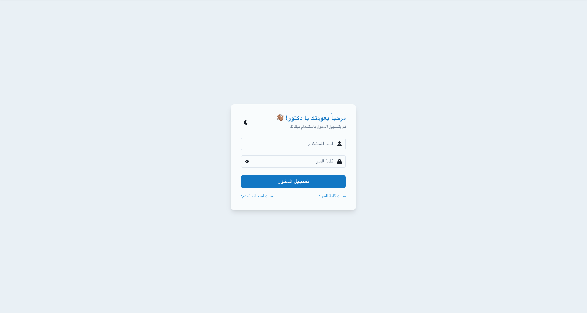
  <b>Login Page</b>
  

   

  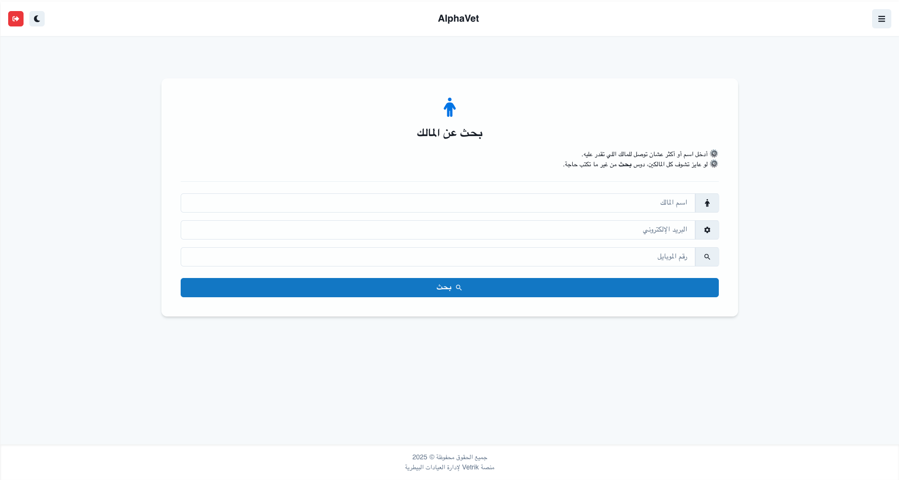
  <b>Search for Owners</b>
  

   

  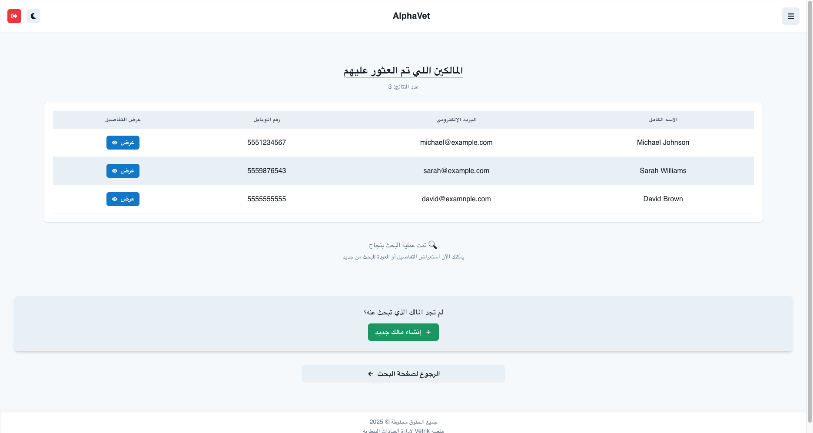
  <b>Owners Found</b>
  

   

  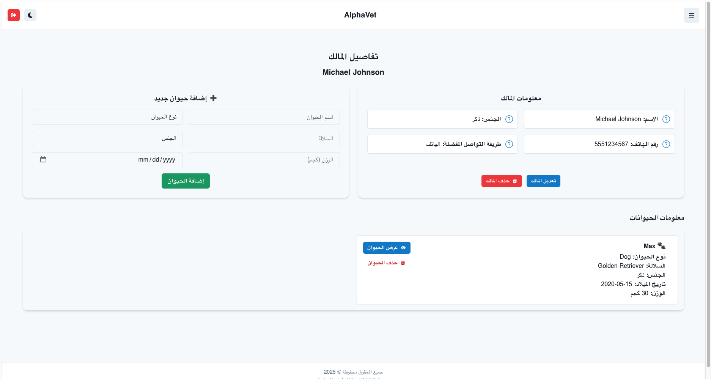
  <b>Owner Details</b>
  

## Vet

  
  <b>Vet Home Page</b>
  

   

  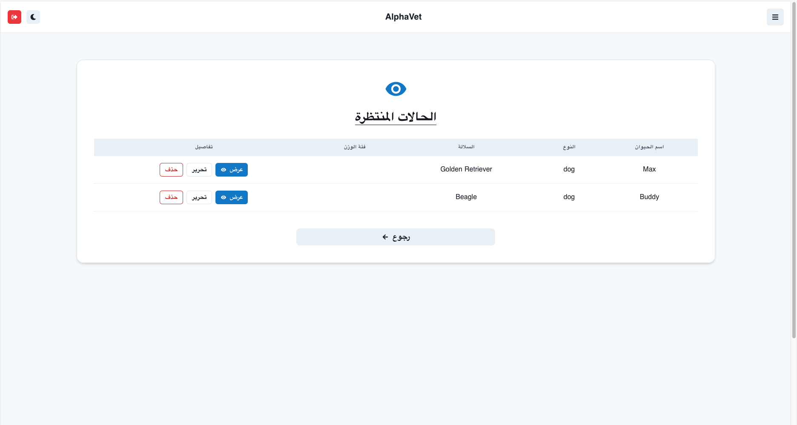
  <b>Vet Cases Waiting</b>
  

   

  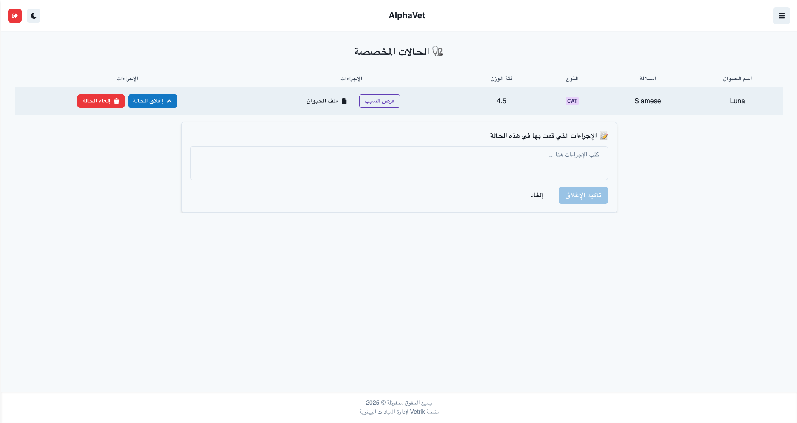
  <b>Vet Assigned Cases</b>
  

   

## Secretary

  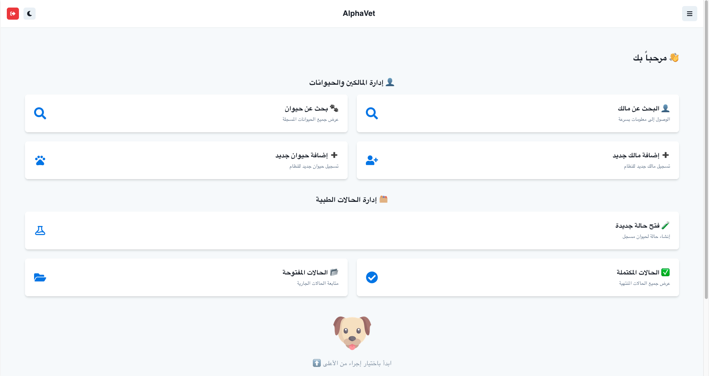
  <b>Secreatry Home Page</b>
  

   

  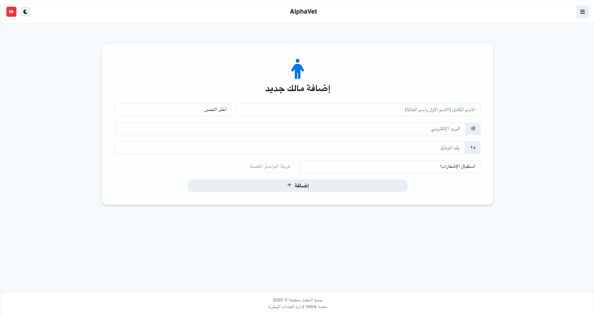
  <b>Add Owner</b>
  

   

  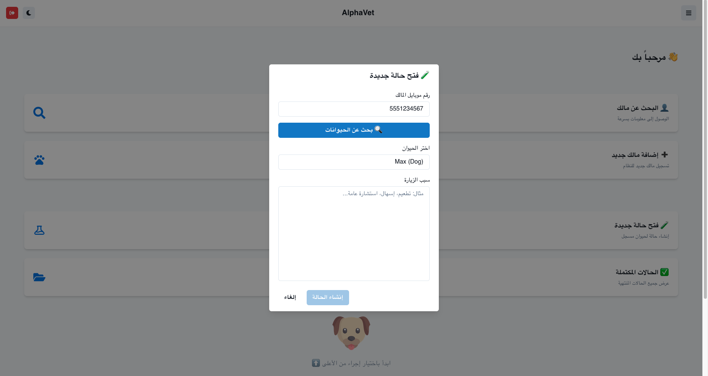
  <b>Open New Case</b>
  

   

  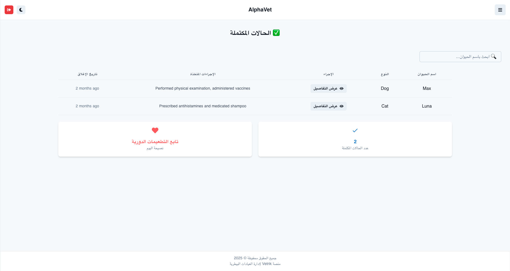
  <b>Completed Cases</b>
  

   

## Admin

  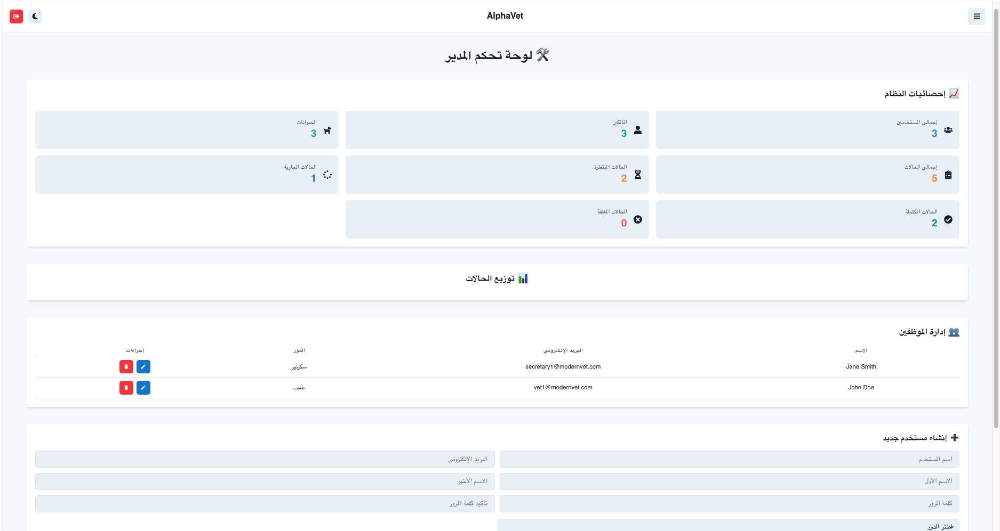
  <b>Admin Home Page</b>
  

   

